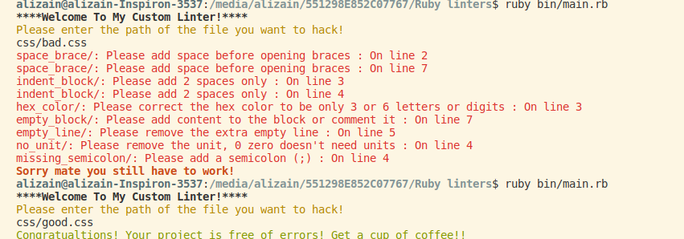
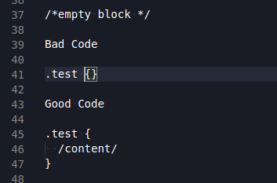
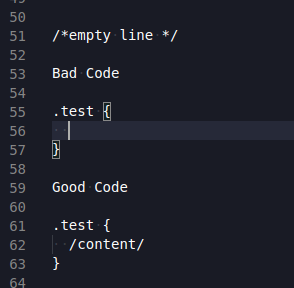
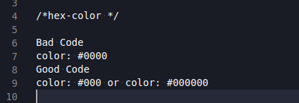
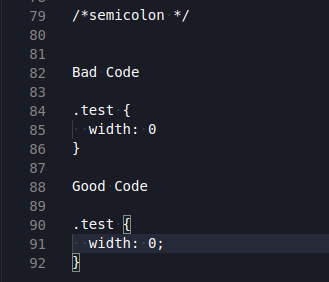
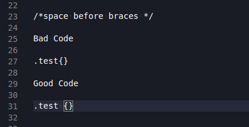
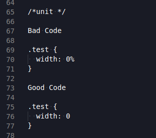

# Ruby-Capstone (CSS-LINTERS)
This project is a CSS Linter, It checks for errors in CSS files
The linter is developed in Ruby, It's a linter for beginners, i.e., it provides feedback about errors or warning in code little by little
## Usage
  - 1-open terminal 
  - 2-mkdir linter-css
  - 3-cd linter-css
  - 4-git clone https://github.com/AbdelrhmanAmin/Ruby-linters
  - 5-run 'bundle install' to install packages
  - 6-excute the linters by running 'ruby bin/main.rb' in terminal
  - 7-Add the name of the file you want to test, For example 'css/bad.css' or 'css/good.css'

## Rules

- ### **Empty Block**:
  
- ### **Empty Line**:
  
- ### **Hex Color**:
  
- ### **Indentation**:
  
- ### **Semicolon**:
  
- ### **Space Braces**:
  
- ### **Unit**:
  

## Author

😎 **Abdo Amin**

- GitHub: [@Abdelrhman-Amin](https://github.com/AbdelrhmanAmin)
- Twitter: [@Abdo Amin](https://twitter.com/AbdoAmi60489112)
- LinkedIn: [@Abdo Amin](https://www.linkedin.com/in/abdoamin/)

## 🤝 Contributing

Contributions, issues, and feature requests are welcome!

Feel free to check the [issues page](https://github.com/AbdelrhmanAmin/CSS-linters/issues).

## 📝 License

This project is [MIT](./LICENSE) licensed.
